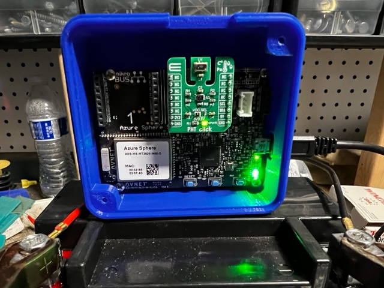
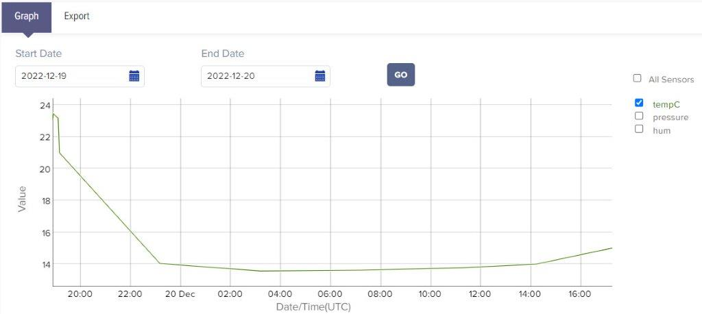

# Low Power Temperature and Humidity Device
I wrote this application to monitor the temperature and humidity of the crawl space under my home.  I wanted something that would run for months from a stand alone battery. 

 "Temperature Humidity Thing"

 "IoTConnect Graph"

## This application was designed to wake up every powerDownPeriod minutes and . . . 
1. Connect to Avnet's IoT Connect Platform
1. Read the temperature, humidity and pressure from the PHT Click Board in Click Socket #2
1. Send telemetry with the sensor data
1. Wait for . . 
   1. Confirmation that the telemetry message was received by the IoT Hub
   1. Check to see if there is a pending OTA update
1. Power down for powerDownPeriod seconds
 
## Azure RTOS real-time application
An Azure RTOS application running on one of the Cortex M4 cores reads sensor data from the PHT click i2c interface.  The application code can be reviewed/modified from the [avnet-azure-sphere-AzureRTOS](https://github.com/Avnet/avnet-azure-sphere-AzureRTOS) repo, see the Avnet-TE-MS8607-RTApp example.

## Device Twins implemented
sleepPeriodMinutes: Takes an integer with the number of minutes to sleep between sensor readings
 
## LED Operation
* Green: Application has started
* Blue: Application connected to IoT Connect and sent a telemetry message with sensor data
* Red: Application received confirmation that the telemtry data was received at the IoT Hub and device is going to sleep
* Green/Red blinking: Device is receiving a OTA update.  Device will sleep once the update is completed
 
 ## Validation
 I did my best to debug the OTA delay logic, it's difficult to do without having the debugger.  Application updates
 happen without any issues.  I have not tested the OTA delay with OS updates, but I think it should work fine.
 
 ## OTA Debug
 If you enable INCLUDE_OTA_DEBUG in main.h you'll see OTA messages from the Click Socket #1 UART Tx signal.  
 Connect your terminal using 115200, 8, N, 1.

 ## How to use this sample
 
1. Install a [PHT Click Board](https://www.mikroe.com/pht-click) into click socket #2 (I'm using a Rev1 Starter Kit)
1. Sideload the binaries/AvnetPHTClickRTApp-App1-V1.imagepackage onto your device
1. Update the app_manifest.json file with your . . . 
   1. ID Scope for your Azure DPS
   1. Set Allowed connections to include the FQDN for your IoT Hub
   1. Set DeviceAuthentication field to your Azure Sphere Tenant ID
1. After the application connects to your IoTHub, set the device twin sleepPeriodMinutes to the number of minutes to sleep between sensor readings
 
