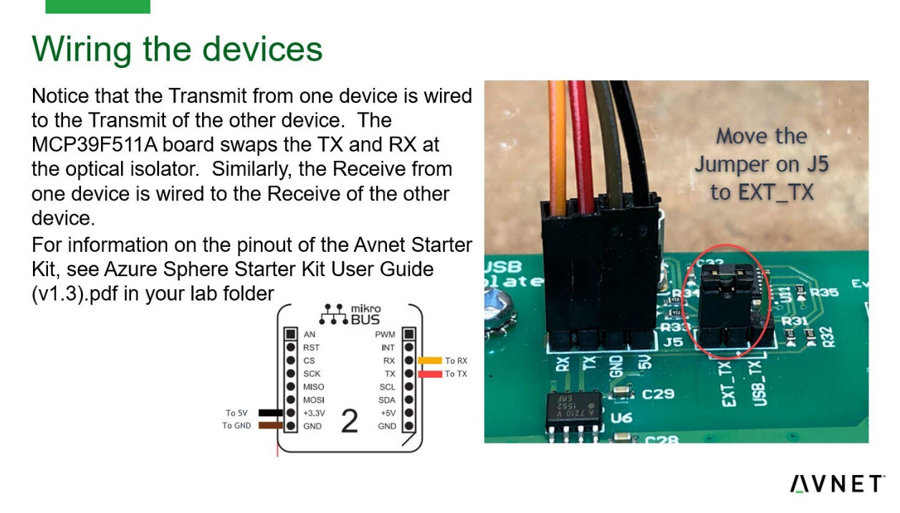
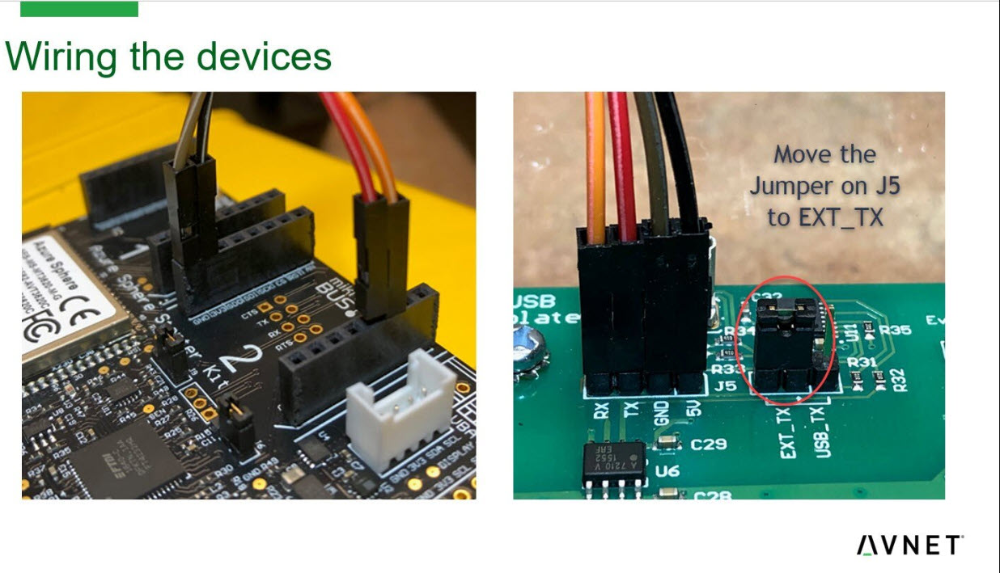

# Avnet Nespresso Demo

This is an Azure Sphere application developed to IoT enable a [Nespresso expresso machine](https://www.amazon.com/gp/product/B01N6TVX8H/ref=ppx_yo_dt_b_asin_title_o00_s00?ie=UTF8&psc=1). 

The application leverages a real-time application running on one of the M4 cores to read power data over a UART from a [MicroChip MCPF511A power monitor demonstration kit](https://www.microchip.com/DevelopmentTools/ProductDetails/adm00667#utm_medium=Press-Release&utm_term=MCP39F511_PR_4-21-15&utm_content=AIPD&utm_campaign=Board).

The application . . . 
1. Reads voltage and current data from the MCPF511A every second
1. When the current is > ```minCurrentThreshold``` a timer is started to track how long the current is > ```minCurrentThreshold```
1. When the current drops back below ```minCurrentThreshold``` a data structure called ```productArray``` is used to determine which product was brewed
    1. When a product is identified telemetry data is sent to the IoT Hub

Additionally . . . 
1. Telemetry is sent up with voltage and current data every ```fMaxTimeBetweenD2CMessages``` seconds
1. Telemetry is sent as soon as the minimum on time has been detected to indicate that the system is **brewing**

The application implements the following device twins to reconfigure the application from Azure

1. ```maxD2CMessageTime```
    - Maximum period between sending telemetry messages
1. ```smallMin```
    - Low threshold in seconds for the small product size
1. ```smallMax```
    - High threshold in seconds for the small product size
1. ```mediumMin```
    - Low threshold in seconds for the medium product size
1. ```mediumMax```
    - High threshold in seconds for the medium product size
1. ```largeMin```
    - Low threshold in seconds for the large product size
1. ```largeMax```
    - Hi threshold in seconds for the large product size
1. ```minCurrentThreshold```
    - The minium current valve to determine if the device is on

**Note:** The min/max times must not overlap or the first product to match will be sent up as telemetry

## To use this application

### Modify the app_manifest.json file

Set the following items for your Azure configuratrion

1. Set ID Scope
1. Set Allowed connections
1. Set DeviceAuthentication

### Wire the device to the Avnet Rev1 Starter Kit as shown




### Sideload the RTApp

1. azsphere device enable-development
1. azsphere device sideload deploy --image-package .\assets\AvnetPWR_RTApp-App1-V1.imagepackage
1. Build and run this high level application

