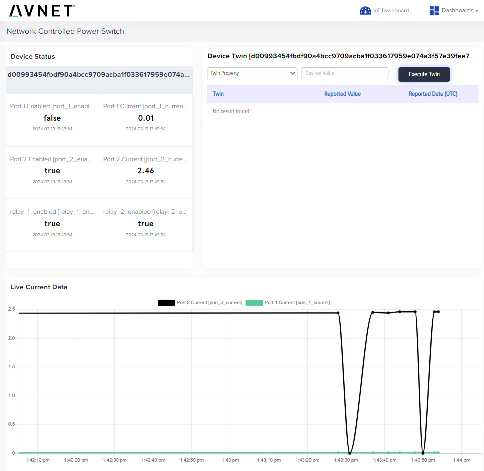

# Avnet netBooter Power Control Project
This project was developed to control a [netBooter NP-0202DU](https://www.synaccess-net.com/np-0202du) from anywhere in the world.  Our team here at Avnet Embedded needs to share some development hardware across the world and we decided to setup a remote hardware station that team members could connect to remotely using TeamViewer.  We also needed a way for remote developers to power cycle the board.  A web hosted dashboard allows developers to drive the Power Outlets and Relays to control equipment from anywhere in the world.

Since the solution uses Azure Sphere, we don't have to worry about security as Microsoft has taken care of all the details for us including . . .

- Over the Air Updates
- Certificate Based Authentication with a new certificate every 24 hours

This application connects to Avnet's IoTConnect cloud solution to expose 5 different device twins to control the two power outlets of the netBooter device, and also drives two relay's implemented with a mikroE Relay Click board.  The application can also connect to Azure with a couple minor changes.


## Hardware Setup

### Required Hardware

1 - [Avnet Azure Sphere Starter Kit Rev2](https://www.avnet.com/shop/us/products/avnet-engineering-services/aes-ms-mt3620-sk-g-2-3074457345643590212/)

1. - [MikroE Eth Click board](https://www.mikroe.com/eth-click)
1. - [MicroE RELAY Click board](https://www.mikroe.com/relay-click)
1. - [netBooter NP-0202DU](https://www.synaccess-net.com/np-0202du)

### Setup the Hardware

1. Insert the Eth Click into click socket #1 on the Azure Sphere Starter Kit
1. Insert the Relay Click into click socket #2 on the Azure Sphere Starter Kit
    1. The Relay click is optional and the application will work fine without it installed
1. Connect an ethernet cable between the Eth Click and the netBooter appliance

## Application Setup

If you're new to Azure Sphere before you go any further you should work through the following self-paced labs selected from the [Azure Sphere Training Plan](https://community.element14.com/products/devtools/avnetboardscommunity/azure-sphere-starter-kits/b/blog/posts/avnet-azure-sphere-training-plan)
1. [Lab1](http://avnet.me/Avnet-AS-Lab1) Create a new Azure Sphere Tenant and prepare your device for development
1. [Lab2](http://avnet.me/Avnet-AS-Lab2) Run your first Azure Sphere Application
1. [Lab6](http://avnet.me/Avnet-AS-Lab6) Connect your device to Avnet's IoTConnect cloud solution

### Config app_manifest.json sample

Using knowledge gained from Lab6, set the following items in the app_manifest.json file

1. Set ID Scope
1. Set Allowed connections
1. Set DeviceAuthentication

### Ethernet Driver
In order for the Ethernet device to work you must sideload the lan-enc28j60-isu0-int5.imagepackage image onto your Azure Sphere Device using the command ```azsphere device sideload deploy --image-package lan-enc28j60-isu0-int5.imagepackage```.  This image is included in the [assets/Board Support Package/](./assets/Board%20Support%20Package/lan-enc28j60-isu0-int5.imagepackage) folder in this project.

# Application Details

## Device Twins for Cloud to Device Control
The application implements the following Device Twins

1. ```port1Enabled```
    - Boolean
    - Enable or Disable Outlet/port #1 on the netBooter
1. ```port2Enabled```
    - Boolean
    - Enable or Disable Outlet/port #2 on the netBooter
1. ```clickBoardRelay1```
    - Boolean
    - Enable or Disable relay #1 on the Relay Click

1. ```clickBoardRelay2```
    - Boolean
    - Enable or Disable relay #2 on the Relay Click

1. ```telemetryPeriodSeconds```
    - Integer
    - Defines the time in seconds between the application sending telemetry up to IoTConnect

## Telemetry Messages

A telemetry message is sent up for the following events

1. Every ```telemetryPeriodSeconds```
1. Each time one of the outlets/ports on the netBooter is changed
1. Each time one of the Relays is changed

Example Telemetry:

```"port_1_enabled": false, "port_1_current":"0.01", "port_2_enabled":true, "port_2_current":"0.00", "relay_1_enabled": true, "relay_2_enabled":false}```

### Button Information

The buttons can also be used to drive the netBooter outlets/ports

**Note** that the device twins may change the state of the ports if the application restarts, or if the connection to Azure/IoTConnect goes down and comes back up.

- ButtonA toggles Port #1
- BottonB toggles Port #2

## IoTConnect Dashboard

