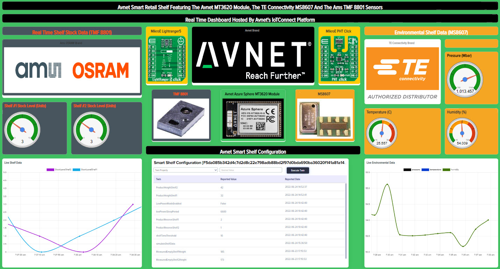

# Avnet Smart Retail Shelf HL App Project

This high level application was developed for an Avnet Demo developed for the 2022 Sensors Converge Conference.  The demo showcases a few things . . .

## Avnet’s Azure Sphere Starter Kit

Avnet’s AES-MS-MT3620-M-G Module is used in the Avnet Azure Sphere Starter Kit for a secure IoT platform.  The MT3620 Azure Sphere device allows for . . . 

1. Fast application development without requiring the developer to develop any security features
1. Automated certificate-based authentication connections to Avnet’s IoTConnect
1. Secure Over the Air (OTA) updates for the two applications running on the device, plus the Azure Sphere Secure OS.
1. Customers can prototype with the starter kit and leverage all application code on a final production product

## Avnet’s IoT Connect Platform

The demo connects to Avnet’s IoT Connect Platform to . . .

1. Allow for remote configuration
1. Send Telemetry Data
1. Display real time data from the smart shelf
1. Send email alerts when shelf stock is low
1. Send email alerts when environmental measurements indicate an issue for the shelf product

## MikroE Click Boards

5 different click boards are utilized in the demo demonstrating how these boards can be used for rapid prototyping.  MikroE driver code was utilized to accelerate software application development.  The shelf dimensions were designed specifically to show click board packaging.

1. 1 - PHT Click (Pressure, Humidity, Temperature) based on the TE Connectivity MS 8607 sensor
1. 2 - Lightranger5 Clicks (Time of Flight (TOF) range measurements) based on the ams OSRAM TMF 8801 TOF sensor
1. 2 - Shuttle Clicks to allow for remote mounting of the sensor click boards 
1. 3 - mikroBUS Shuttles to remote mount the 3 sensor click boards

## TE Connectivity MS 8607 Environmental Sensor

The MS 8607 sensor is used to capture real time shelf environmental data.

## ams OSRAM TMF 8801 Time of Flight Sensor

The TMF 8801 devices are used to measure the distance from the sensor to the top of whatever stock is in the smart shelf.  There is one TMF 8801 for each shelf.

# The Demo Story
The Avnet Smart Retail Shelf is a fully functional smart retail shelf.  This solution could be deployed into any retail environment to allow for . . .

1. Automated inventory tracking: Reduce labor by automatically capturing/tracking stock levels
1. Automated notification when stock levels are low: Reduce labor by automatically sending emails to vendors when shelf stock falls below some level
1. Automated environmental monitoring of temperature, humidity, and atmospheric pressure: Send maintenance emails if environmental reading fall outside acceptable levels.
 The demo hardware/software
1. Monitors stock in two separate shelfs
1. Sends stock shelf data to IoT Connect only when the shelf stock changes
1. Sends low stock alerts when either shelf stock drops below some configurable level

Allows for remote configuration of . . .
1. Product height measurements in mm for each shelf
1. Low stock levels for each shelf
1. Includes a demo feature (simulate shelf data) that will generate range data to drive the IoT Connect dashboard without any human interaction
Constraints

If this solution were to be deployed in a real-word situation, the shelf would need to constrain the product so that it could be properly measured.  Think of a vending machine where stock is always in a predefined stack, or tobacco products in a display/storage case.

### Improvements

1. Add a third range sensor to detect when someone is standing in front of the shelf.  Use this data to determine how popular a shelf is and how long customers stay engaged with the shelf
1. Implement a low power feature.  If we’re only measuring stock, we could keep the device in a low power state and wake once or twice a day to measure stock and send telemetry data to the cloud.

## Architecture

## Cloud Dashboard on Avnet's IoT Connect

## Avnet's IoT Connect Platform

This solution leverages Avnet's IoT Connect Platform built on Azure.  To convert the appliation to talk directly to an IoT Hub or IoT Central application make the following changes . . .

1. Comment out the "#define USE_AVNET_IOTCONNECT" statement in main.h
1. Update the app_manifest.json file with your . . . 
  1. DPS Scope ID
  1. IoTHub Hostname
  1. Azure Sphere Tenent ID (DeviceAuthentication entry)

# Build your own Smart Retail Shelf Demo

You're welcome to reproduce this demo, everthing you need is included in this repo . . .

1. Purchase a Rev2 Starter Kit
1. Print the 3D parts in the 3DPartsToPrint directory
1. Purchase the click boads and three mikroShuttles
  1. Insert the Shuttle Clicks into the Rev2 Starter Kit
  1. Connect the PHT click and one Lightranger5 click to the Click Socket #1 Shuttle Click.  Install this Lightranger into the first shelf
  1. Connect the second LightRanger5 click into the Click Socket #2 Shuttle click
1. Sideload the binary in the RTApp folder onto your starter kit
  1. azsphere device sideload deploy AvnetPHT-LightRangerClickRTApp-App1-V1.imagepackage
  1. This application can be reviewed or updated from [this github repo](https://github.com/Avnet/avnet-azure-sphere-AzureRTOS/tree/main/Examples/Avnet-SmartRetailShelf-PHT-Lightranger5-RTApp)
1. Update the app_manifest.json file with your IoT Connect/IoT Hub/IoT Central connection details 
  1. If using IoT Connect I've provided a device template in the IoTConnect folder
1. Create you own dashboard
