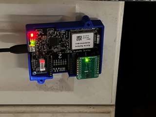
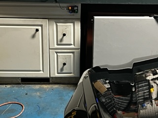

# Avnet Azure Sphere Smart Parking application

 Simple non-IoT Connected smart parking application to help you pull into your garage featuring the ams OSRAM TMF8801 Time-of-Flight sensor.
 
 1. Install a Lightranger5 click board into your starter kit
 1. The RTAppBinary/AvnetLightRanger5Click-Rev1-Click1-App1-V2.imagepackage binary assumes
    a Rev1 Avnet Starter Kit with the Lightranger5 board in click socket #1.  If you want to 
    use a Rev2 board find the appropriate RTApp binary in [this](https://github.com/Avnet/avnet-azure-sphere-AzureRTOS/tree/main/binaries/RTApp-1-Images) repo.  
 1. Sideload the RTApp binary 
     1. ```azsphere device sideload deploy -p RTAppBinary/AvnetLightRanger5Click-Rev1-Click1-App1-V2.imagepackage```
 1. Build and load this high level application
 1. Install the Starter Kit in your garage in front of your vehicle
     1. If you have a hard time getting the range to work properly you can connect a Serial Port device to the dedicated M4 TX uart to see the range values that the Lightranger5 device is reporting
     1. My installation had issues when using the grill (with open slots) so I located the device to measure the range of the corner of my car.
 1. Park the vehicle where you want it to stop
 1. Press the user button A to set the target distance between your vehicle and the Starter Kit
     1. The target distance is stored in persistant memory to retain value across device resets
 1. Avnet assumes no libility or responsibility for any damage that occurs using this sample application. 
 
 # Expected Behavior
 Once the device is installed and the target distance set (User Button A) the application will use the onboard RGB LED to indicate parking status.

The application defines three different ranges, near, medium and far. These ranges are based on the target range.

 * No car in range: Solid Green
 * Car in long range: Blinking Green
 * Car in medium range: Blinking Blue
 * Car in close range: Fast blinking Red
 * Car <= target range: Solid Red





 